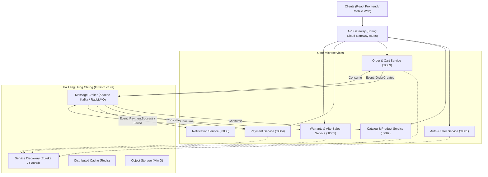
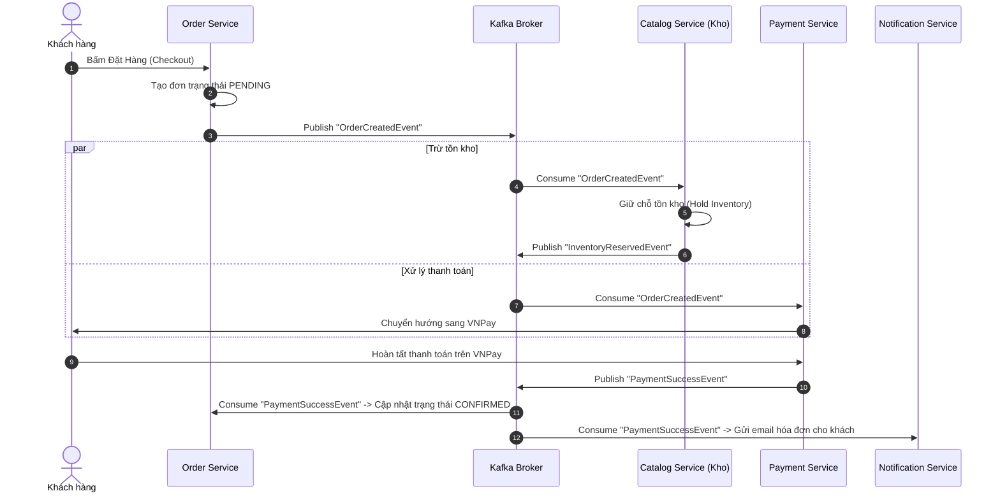

# Kế Hoạch & Kiến Trúc Chuyển Đổi Microservices (TechZone Computer E-Commerce)

> **Tài liệu tham khảo & thiết kế kiến trúc vi dịch vụ (Microservices Architecture Proposal)**
> **Dự án gốc**: TechZone Computer E-commerce (Spring Boot, Java 21, PostgreSQL, Redis, MinIO)

---

## 1. Tổng quan & Đánh giá hiện trạng (As-Is Assessment)

Hiện tại, hệ thống Backend của TechZone đang được tổ chức theo mô hình **Modular Monolith** với các module tách biệt rõ ràng trong `com.techzone.computer.modules`:

- **Quản lý danh mục & hàng hóa**: `product`, `brand`, `manufacturer`
- **Giao dịch & bán hàng**: `cart`, `order`, `payment`, `voucher`
- **Người dùng & tài khoản**: `user`
- **Hậu mãi & trải nghiệm**: `warranty` (bảo hành linh kiện/máy tính), `review` (đánh giá), `wishlist`
- **Hệ thống & cấu hình**: `setting`, `health`

### Điểm mạnh hiện tại

1. Cấu trúc module theo domain đã có sẵn, ranh giới (bounded context) tương đối rõ ràng.
2. Công nghệ hiện đại: Java 21, Spring Boot, PostgreSQL, Redis, MinIO, Docker Compose.

### Động lực chuyển đổi sang Microservices (To-Be Drivers)

1. **Khả năng mở rộng độc lập (Independent Scalability)**: Các tính năng xem/tìm kiếm sản phẩm (`product`) có lượt đọc (read-heavy) gấp hàng trăm lần tính năng đặt hàng (`order`) và thanh toán (`payment`).
2. **Khả năng chịu lỗi (Fault Isolation)**: Nếu cổng thanh toán VNPay hoặc dịch vụ gửi mail/bảo hành gặp sự cố, khách hàng vẫn phải xem được sản phẩm và thêm vào giỏ hàng bình thường.
3. **Triển khai độc lập (CI/CD)**: Cập nhật giao diện khuyến mãi/voucher không yêu cầu build và deploy lại toàn bộ lõi thanh toán và tài khoản.

---

## 2. Sơ đồ kiến trúc đề xuất (Target Architecture)



---

## 3. Chi tiết phân rã dịch vụ (Service Breakdown & Database-per-service)

Mỗi service sở hữu **Database riêng (Database-per-service)** để đảm bảo tính độc lập dữ liệu tuyệt đối (Loosely Coupled).

| Service                                 | Chức năng & Modules gốc                                                                                               | Công nghệ đề xuất                                                   | Lưu trữ (Data Store)                                             |
| :-------------------------------------- | :----------------------------------------------------------------------------------------------------------------------- | :----------------------------------------------------------------------- | :----------------------------------------------------------------- |
| **API Gateway**                   | Routing, Rate-limiting, Centralized JWT Validation, CORS                                                                 | Spring Cloud Gateway                                                     | Redis (Rate Limiter)                                               |
| **Auth & User Service**           | Đăng ký, đăng nhập, phân quyền (RBAC: Admin/Staff/Customer), thông tin profile                                  | Spring Security, JJWT / OAuth2                                           | PostgreSQL (`db_auth_user`)                                      |
| **Product & Catalog Service**     | Sản phẩm PC/Laptop/Linh kiện, Thương hiệu (`brand`), Hãng (`manufacturer`), Tồn kho cơ bản (`inventory`) | Spring Data JPA, Redis Cache, Elasticsearch (tuỳ chọn tìm kiếm sâu) | PostgreSQL (`db_catalog`), MinIO (ảnh), Redis (cache danh mục) |
| **Order & Cart Service**          | Giỏ hàng (`cart`), đặt hàng (`order`), mã giảm giá (`voucher`), tính phí ship                            | Spring Data JPA, Saga Orchestrator                                       | PostgreSQL (`db_order`), Redis (Cart tạm)                       |
| **Payment Service**               | Xử lý thanh toán VNPay, MoMo, COD, lưu log đối soát                                                               | Spring Data JPA, Webhook Callbacks                                       | PostgreSQL (`db_payment`)                                        |
| **Warranty & Aftersales Service** | Tra cứu bảo hành theo Serial/IMEI linh kiện (`warranty`), đánh giá (`review`), yêu thích (`wishlist`)     | Spring Data JPA                                                          | PostgreSQL (`db_aftersales`)                                     |
| **Notification Service**          | Gửi email xác nhận đơn hàng, OTP, thông báo trạng thái bảo hành                                              | Spring Mail, Thymeleaf template                                          | MongoDB / NoSQL (lưu log thông báo)                             |

---

## 4. Các giải pháp cho bài toán kỹ thuật trọng điểm

### 4.1. Giao tiếp giữa các Service (Inter-service Communication)

1. **Đồng bộ (Synchronous - REST / OpenFeign):**
   * Chỉ sử dụng cho các luồng cần dữ liệu tức thời và không thay đổi trạng thái (chỉ đọc), ví dụ: `Order Service` gọi `Catalog Service` qua Feign Client để lấy giá sản phẩm mới nhất khi thêm vào giỏ.
   * Áp dụng **Resilience4j** (Circuit Breaker, Retry, Fallback) để tránh lỗi dây chuyền (Cascading Failure).
2. **Bất đồng bộ (Asynchronous - Event-Driven qua Kafka):**
   * Sử dụng cho toàn bộ luồng nghiệp vụ tạo đơn, thanh toán, trừ kho, gửi thông báo.

### 4.2. Xử lý Distributed Transactions: Saga Pattern

Thay vì dùng 2-Phase Commit (2PC) vốn làm chậm hệ thống, áp dụng **Saga Pattern (Choreography hoặc Orchestration)** cho luồng đặt hàng:



> **Cơ chế Bù trừ (Compensating Transaction):**
> Nếu thanh toán thất bại (`PaymentFailedEvent`) hoặc kho không đủ hàng (`InventoryShortageEvent`), Kafka sẽ bắn event báo `Order Service` hủy đơn (`CANCELLED`) và `Catalog Service` nhả lại số lượng tồn kho (Rollback).

### 4.3. Quản trị định danh và bảo mật (Distributed Security)

* Client gửi request mang JWT token đến **API Gateway**.
* API Gateway xác thực chữ ký token. Nếu hợp lệ, Gateway đính kèm thông tin user vào HTTP Header (ví dụ: `X-User-Id`, `X-User-Roles`) rồi chuyển tiếp xuống các service nội bộ.
* Các service nội bộ không cần kết nối lại DB xác thực, chỉ cần đọc Header tin cậy từ Gateway.

---

## 5. Lộ trình triển khai khuyến nghị (Step-by-Step Migration Roadmap)

Không nên đập đi xây lại toàn bộ cùng lúc (tránh Big Bang Migration). Cách tiếp cận an toàn nhất là **Strangler Fig Pattern**:

### Giai đoạn 1: Chuẩn bị hạ tầng & Service đầu tiên (PoC - 1 đến 2 tuần)

1. Thêm Message Broker (`Kafka` hoặc `RabbitMQ`) vào file `docker-compose.yml`.
2. Tạo **Notification Service** riêng biệt.
3. Monolith hiện tại khi có đơn hàng hoặc đăng ký mới sẽ bắn event qua Message Broker -> Notification Service gửi mail.

### Giai đoạn 2: Tách Auth & API Gateway (2 đến 3 tuần)

1. Dựng **Spring Cloud Gateway**. Chuyển toàn bộ routing của Frontend qua Gateway.
2. Tách module `user` thành **Auth & User Service**. Quản lý xác thực JWT tập trung.

### Giai đoạn 3: Tách Core Domain (Order & Catalog & Payment) (3 đến 4 tuần)

1. Tách `product`, `brand`, `manufacturer` thành **Catalog Service**.
2. Tách `payment` thành **Payment Service** (giữ nguyên tích hợp VNPay hiện có).
3. Tách `order`, `cart`, `voucher` thành **Order Service**. Triển khai Saga flow.

### Giai đoạn 4: Giám sát & Quan sát hệ thống (Observability)

1. Cấu hình **Micrometer + Prometheus + Grafana** để giám sát CPU, RAM, RPS của từng service.
2. Tích hợp **OpenTelemetry / Zipkin** để truy vết luồng request phân tán (Distributed Tracing).

---

## 6. Mẫu cấu trúc thư mục sau khi chuyển đổi (Maven Multi-Module)

```text
techzone-computer/
├── api-gateway/                      # Spring Cloud Gateway
├── common-library/                   # DTO dùng chung, Event models, Exception handling
├── services/
│   ├── auth-service/                 # User & Security
│   ├── catalog-service/              # Product, Brand, Category, Inventory
│   ├── order-service/                # Cart, Order, Voucher
│   ├── payment-service/              # VNPay, MoMo, Webhooks
│   ├── warranty-service/             # Warranty serial/IMEI, Reviews
│   └── notification-service/         # Email, SMS
├── Frontend/                         # React/Vite Client
├── docker-compose.yml                # Khởi chạy toàn bộ hệ thống
└── README.md
```
