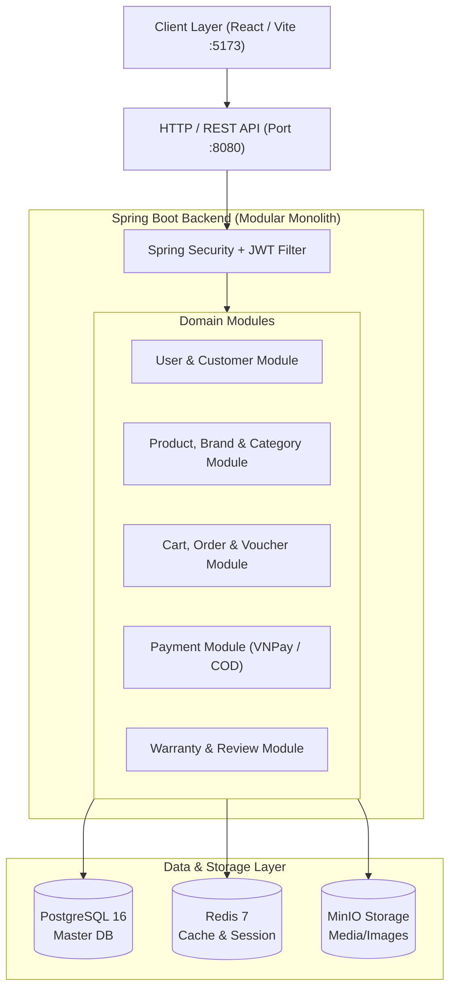

# TechZone Computer E-Commerce Platform

> Nền tảng thương mại điện tử chuyên biệt kinh doanh thiết bị tin học, máy tính & linh kiện công nghệ cao.  
> Xây dựng theo kiến trúc hiện đại, phân tách hoàn toàn giữa Frontend, Backend (Modular Monolith), Cơ sở dữ liệu và Hạ tầng container hóa.

---

## Mục Lục
1. [Mô tả dự án & Công nghệ sử dụng](#1-mô-tả-dự-án--công-nghệ-sử-dụng)
2. [Kiến trúc tổng quan hệ thống](#2-kiến-trúc-tổng-quan-hệ-thống)
3. [Yêu cầu môi trường & Cài đặt](#3-yêu-cầu-môi-trường--cài-đặt)
4. [Cấu hình PostgreSQL & Biến môi trường](#4-cấu-hình-postgresql--biến-môi-trường)
5. [Hướng dẫn chạy Backend & Frontend](#5-hướng-dẫn-chạy-backend--frontend)
6. [Seed dữ liệu & Tài khoản thử nghiệm](#6-seed-dữ-liệu--tài-khoản-thử-nghiệm)
7. [API Endpoints chính & Hướng dẫn Test](#7-api-endpoints-chính--hướng-dẫn-test)
8. [Chạy Unit Test & Integration Test](#8-chạy-unit-test--integration-test)
9. [Cấu hình VNPay Sandbox (Bảo mật Secret)](#9-cấu-hình-vnpay-sandbox-bảo-mật-secret)

---

## 1. Mô tả dự án & Công nghệ sử dụng

Hệ thống cung cấp giải pháp bán lẻ công nghệ toàn diện: Quản lý danh mục sản phẩm (PC, Laptop, CPU, VGA, RAM...), giỏ hàng, áp mã giảm giá (voucher), tra cứu bảo hành qua IMEI/Serial number, thanh toán trực tuyến qua VNPay và cổng quản trị vận hành nội bộ (Internal Ops/Admin).

### Tech Stack Chi Tiết

* **Frontend:**
  * **Core**: React 18, TypeScript, Vite.
  * **UI & Styling**: Tailwind CSS, Radix UI Primitives, Lucide Icons.
  * **State & Data**: Zustand (Store), TanStack Query / Axios.
  * **Testing**: Vitest.
* **Backend:**
  * **Core**: Java 21, Spring Boot (Spring MVC, Modular Monolith).
  * **Security**: Spring Security 6, JWT (OAuth2 Resource Server / JJWT).
  * **Persistence**: Spring Data JPA / Hibernate, Flyway Database Migrations.
  * **Caching & Performance**: Redis 7 (Cache sản phẩm, giỏ hàng, phân trang).
  * **Storage**: MinIO S3-compatible Object Storage (Lưu trữ ảnh sản phẩm, linh kiện).
  * **Tài liệu API**: Springdoc OpenAPI / Swagger UI 3.
* **Database:**
  * PostgreSQL 16 (Full-text search, trigram search `pg_trgm`, UUID).
* **DevOps & Infrastructure:**
  * Docker & Docker Compose (Quản lý đa container: PostgreSQL, Redis, MinIO, Backend, Frontend).
  * Maven Wrapper (`mvnw`).

---

## 2. Kiến trúc tổng quan hệ thống

Dự án áp dụng mô hình **Modular Monolith** kết hợp phân tầng (Layered Architecture):



* **Frontend** giao tiếp với **Backend** thông qua RESTful APIs chuẩn JSON.
* **Xác thực**: JWT Bearer Token đính kèm trong header `Authorization: Bearer <token>`.
* **Phân quyền người dùng**:
  * **CUSTOMER / USER**: Đăng nhập mua hàng, áp voucher, xem giỏ hàng, tra cứu bảo hành.
  * **ADMIN / STAFF**: Quản lý kho, xử lý đơn hàng, thêm sửa sản phẩm, đối soát thanh toán tại route `/internal/*`.

---

## 3. Yêu cầu môi trường & Cài đặt

Trước khi bắt đầu, hãy đảm bảo máy tính đã cài đặt các công cụ sau:

| Công cụ | Phiên bản khuyến nghị | Kiểm tra cài đặt |
| :--- | :--- | :--- |
| **Java Development Kit (JDK)** | **Java 21 LTS** (hoặc tối thiểu Java 17) | `java -version` |
| **Node.js** | `>= 20.x LTS` | `node -v` |
| **Package Manager (pnpm)** | `>= 9.x` (`npm install -g pnpm`) | `pnpm -v` |
| **Docker & Docker Compose** | Docker Desktop 4.x trở lên | `docker --version` |
| **Git** | Phiên bản mới nhất | `git --version` |

---

## 4. Cấu hình PostgreSQL & Biến môi trường

### 4.1. Cấu hình Backend (`Backend/.env`)
Copy file mẫu từ `Backend/.env.example` sang `Backend/.env`:

```bash
cd Backend
cp .env.example .env     # Trên Linux/macOS
copy .env.example .env   # Trên Windows PowerShell / CMD
```

Nội dung cấu hình quan trọng trong `Backend/.env`:

```properties
# Database PostgreSQL
DB_URL=jdbc:postgresql://localhost:5432/techzone_computer
DB_USERNAME=postgres
DB_PASSWORD=postgres

# Redis Caching
REDIS_HOST=localhost
REDIS_PORT=6379
REDIS_PASSWORD=

# MinIO Object Storage
MINIO_ENDPOINT=http://localhost:9000
MINIO_ACCESS_KEY=minioadmin
MINIO_SECRET_KEY=minioadmin
MINIO_BUCKET=computer-shop-storage
STORAGE_MINIO_ENABLED=true

# Bảo mật JWT
JWT_ISSUER=techzone-api
JWT_SECRET=techzone-super-secret-key-at-least-32-characters-long-2026

# Server Port & CORS
SERVER_PORT=8080
CORS_ALLOWED_ORIGINS=http://localhost:5173,http://localhost:3000

# VNPay Sandbox (Xem chi tiết ở mục 9)
VNPAY_TMN_CODE=YOUR_SANDBOX_TMN_CODE
VNPAY_HASH_SECRET=YOUR_SANDBOX_HASH_SECRET
VNPAY_URL=https://sandbox.vnpayment.vn/paymentv2/vpcpay.html
VNPAY_RETURN_URL=http://localhost:5173/checkout
```

### 4.2. Cấu hình Frontend (`Frontend/.env`)
Tạo file `Frontend/.env` (hoặc `.env.local`):

```properties
VITE_API_BASE_URL=http://localhost:8080/api
```

---

## 5. Hướng dẫn chạy Backend & Frontend

### Cách 1: Chạy trực tiếp (Local Development) - Khuyến nghị khi lập trình

#### Bước 1: Khởi động cơ sở dữ liệu và dịch vụ hỗ trợ qua Docker
Không cần cài đặt thủ công Postgres/Redis/MinIO lên máy, chỉ cần chạy:
```bash
docker compose up -d postgres redis minio
```

#### Bước 2: Chạy Backend (Spring Boot)
Mở một terminal mới:
```bash
cd Backend
# Trên Windows:
.\mvnw.cmd spring-boot:run

# Trên Linux/macOS:
./mvnw spring-boot:run
```
* Backend sẽ khởi động tại: `http://localhost:8080`
* Tài liệu Swagger UI: `http://localhost:8080/swagger-ui/index.html`

#### Bước 3: Chạy Frontend (React / Vite)
Mở terminal thứ hai:
```bash
cd Frontend
pnpm install
pnpm dev
```
* Giao diện khách hàng (Customer Portal): `http://localhost:5173`
* Giao diện quản trị (Admin Portal): `http://localhost:5173/internal`

---

### Cách 2: Chạy trọn gói toàn bộ hệ thống bằng Docker Compose

Dành cho việc kiểm thử môi trường production hoặc demo nhanh:

```bash
docker compose up -d --build
```
Dịch vụ sẽ tự động build và chạy:
- Frontend: `http://localhost:5173`
- Backend: `http://localhost:8080`
- MinIO Web Console: `http://localhost:9001` (User/Pass: `minioadmin` / `minioadmin`)

Để dừng toàn bộ hệ thống:
```bash
docker compose down
```

---

## 6. Seed dữ liệu & Tài khoản thử nghiệm

Khi Docker khởi chạy PostgreSQL lần đầu tiên, file SQL khởi tạo `Database/init.sql` (hoặc các file Flyway migration `V1...`, `V2...`) sẽ tự động chạy để tạo bảng và nạp dữ liệu mẫu (sản phẩm PC, linh kiện, thương hiệu Asus, MSI, Dell, voucher...).

### Danh sách tài khoản thử nghiệm có sẵn:

| Loại tài khoản | Email đăng nhập | Mật khẩu mặc định | Quyền hạn (Role) | Mô tả |
| :--- | :--- | :--- | :--- | :--- |
| **Quản trị viên (Admin)** | `quock@techzone.vn` | `123456` | `ADMIN` | Toàn quyền quản trị kho, đơn hàng, khách hàng |
| **Vận hành (Staff)** | `ops@techzone.vn` | `123456` | `ADMIN` | Quản lý vận hành đơn hàng và khiếu nại |
| **Khách hàng thường** | `customer@techzone.vn` | `123456` | `CUSTOMER` | Khách mua hàng, điểm tích lũy Bạc |
| **Khách hàng VIP** | `vip@techzone.vn` | `123456` | `CUSTOMER` | Hạng thẻ Kim Cương (tích điểm nhiều) |

> **Cách seed lại dữ liệu thủ công nếu cần:**  
> Nếu bạn muốn reset và nạp lại dữ liệu, chạy lệnh:
> ```bash
> docker compose exec -T postgres psql -U postgres -d techzone_computer < Database/init.sql
> ```

---

## 7. API Endpoints chính & Hướng dẫn Test

Bạn có thể test trực tiếp thông qua **Swagger UI** tại `http://localhost:8080/swagger-ui/index.html` hoặc dùng Postman / cURL.

### 7.1. Authentication (`/api/auth`)
* `POST /api/auth/login`: Đăng nhập lấy JWT Bearer token.
* `POST /api/auth/register`: Đăng ký tài khoản khách hàng mới.
* `GET /api/auth/me`: Lấy thông tin user hiện tại (yêu cầu header `Authorization: Bearer <token>`).

**Ví dụ test cURL Đăng nhập:**
```bash
curl -X POST http://localhost:8080/api/auth/login \
  -H "Content-Type: application/json" \
  -d "{\"email\": \"quock@techzone.vn\", \"password\": \"123456\"}"
```

### 7.2. Sản phẩm & Danh mục (`/api/products`, `/api/brands`, `/api/categories`)
* `GET /api/products`: Danh sách sản phẩm kèm lọc theo category, brand, giá, phân trang.
* `GET /api/products/{id}`: Chi tiết thông số kỹ thuật sản phẩm máy tính/linh kiện.
* `POST /api/products`: Tạo mới sản phẩm (Quyền `ADMIN`).

### 7.3. Đơn hàng & Giỏ hàng (`/api/orders`, `/api/cart`)
* `GET /api/cart`: Lấy thông tin giỏ hàng của user.
* `POST /api/cart/items`: Thêm sản phẩm vào giỏ hàng.
* `POST /api/orders`: Tạo đơn đặt hàng mới.
* `GET /api/orders/{id}`: Tra cứu trạng thái đơn hàng.

### 7.4. Bảo hành & Hậu mãi (`/api/warranty`)
* `GET /api/warranty/lookup?serialNumber=...`: Tra cứu thời hạn và lịch sử bảo hành linh kiện.

---

## 8. Chạy Unit Test & Integration Test

Hệ thống được viết đầy đủ test suite bao phủ các module trọng yếu (`Order`, `Payment`, `VNPay`, `Voucher`, `Stock`, `Cart`, `User/Auth`).

### 8.1. Chạy toàn bộ Test Suite (Maven Wrapper)

```powershell
cd Backend
.\mvnw.cmd clean test
```
*(Trên Linux/macOS: `./mvnw clean test`)*

### 8.2. Chạy riêng từng Unit Test

```powershell
# Test quy trình thanh toán VNPay
.\mvnw.cmd test -Dtest=PaymentServiceTest

# Test quy trình kiểm tra tồn kho & tạo đơn hàng
.\mvnw.cmd test -Dtest=OrderServiceTest

# Test tính hợp lệ của mã giảm giá (Voucher)
.\mvnw.cmd test -Dtest=VoucherServiceTest
```

### 8.3. Chạy Integration Test (Testcontainers)
Dự án sử dụng **Testcontainers** để tự động kéo container PostgreSQL độc lập khi chạy integration test:
```powershell
.\mvnw.cmd test -Dtest=*IntegrationTest
```
> **Lưu ý**: Cần bật Docker Desktop trước khi chạy Integration Test với Testcontainers.

---

## 9. Cấu hình VNPay Sandbox (Bảo mật Secret)

Để thử nghiệm tính năng thanh toán online mà không làm lộ thông tin bí mật kinh doanh lên Github:

### 9.1. Nguyên tắc bảo mật quan trọng
1. **Tuyệt đối không commit file `.env` lên Git**: File `.env` đã được cấu hình trong `.gitignore`.
2. Chỉ đưa các biến không mang giá trị thật vào file mẫu `.env.example`.

### 9.2. Lấy thông tin tài khoản VNPay Sandbox
Đăng ký hoặc sử dụng tài khoản thử nghiệm từ [VNPay Sandbox Portal](https://sandbox.vnpayment.vn/devreg/):
* **VNPAY_TMN_CODE**: Mã định danh merchant (Terminal ID).
* **VNPAY_HASH_SECRET**: Khóa bí mật dùng để tạo và kiểm tra chữ ký số SHA512 (Checksum).

Điền 2 giá trị này vào file `.env` trên máy cá nhân của bạn:
```properties
VNPAY_TMN_CODE=YOUR_SANDBOX_TMN_CODE
VNPAY_HASH_SECRET=YOUR_SANDBOX_HASH_SECRET
VNPAY_URL=https://sandbox.vnpayment.vn/paymentv2/vpcpay.html
VNPAY_RETURN_URL=http://localhost:5173/checkout
```

### 9.3. Thông tin thẻ ngân hàng thử nghiệm trên môi trường Sandbox

Khi được chuyển hướng tới trang thanh toán VNPay, sử dụng thông tin thẻ test sau:

* **Ngân hàng**: `NCB`
* **Số thẻ**: `9704198526191432198`
* **Tên chủ thẻ**: `NGUYEN VAN A`
* **Ngày phát hành**: `07/15`
* **Mã OTP**: `123456`

Thanh toán sẽ tự động trả kết quả về callback URL và cập nhật trạng thái đơn hàng sang `PAID`.

---

## License & Tác quyền
Dự án được phát triển phục vụ mục đích học tập và nghiên cứu công nghệ e-commerce.
